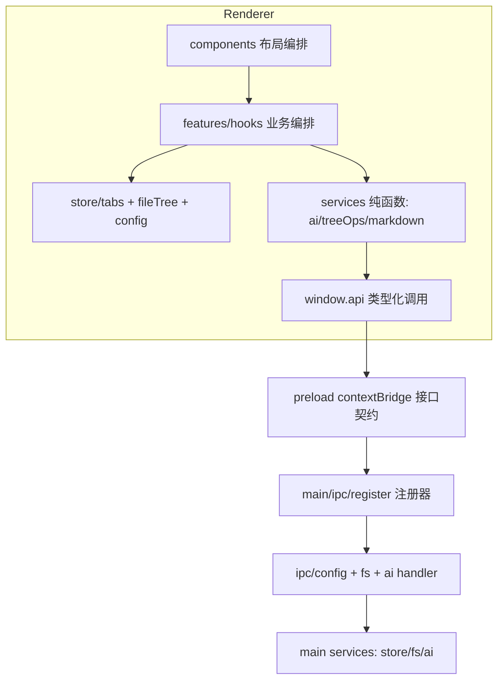

## 用户需求

为 EasyPrompt（Electron 本地优先桌面 Prompt 编辑器）制定渐进式架构优化计划，将现有代码重构为高内聚、低耦合的模块化结构：

- 识别可独立封装的模块，明确职责边界，消除重复代码与循环依赖
- 解耦业务逻辑、数据访问、外部服务调用（AI API / 文件系统）与 UI 层
- 每个步骤标注对应的 SOLID 原则（单一职责、依赖倒置等）
- 分阶段实施：模块拆分 → 接口抽象 → 依赖注入 → 公共组件抽取，每阶段说明目标与风险
- 渐进式改造，兼容迁移成本，禁止一次性大规模重写

## 现状核心问题（已确认）

1. **Workspace.tsx（718 行）上帝组件**：同时编排标签页、保存流程、AI 工作流、上下文菜单、对话框管理
2. **服务层反向依赖状态层**：`services/ai.ts` 直接读 `useConfigStore`；`workspaceRoot.ts` 命名为 service 实为 store 派生 hook
3. **workspace store 混合四种职责**：Tab 状态机 + 文件树 + 树排序持久化 + 文件标记持久化
4. **主进程 IPC 单文件**：`main/ipc/index.ts` 集中 config/fs/ai 全部 handler
5. **UI 组件直接调用数据访问 service**：乐观更新逻辑散落在 Sidebar/FileTreeView/NewFileInput

## 硬性约束

重构全程不得破坏 AGENTS.md 中的行为契约（Tab 状态机语义、1.5s 轮询+乐观更新、流式 AI 生命周期、Windows 路径处理、IPC 四段同步链路、密钥掩码规则），每阶段以 `pnpm typecheck` + `pnpm dev` 手工回归验证。

## Tech Stack

沿用现有栈，不引入新框架：Electron 33 + TypeScript + React 18 + Zustand 5 + Tailwind 3 + CodeMirror 6，pnpm 构建。依赖注入采用 TypeScript 函数参数注入（无需 DI 框架），接口抽象用 `src/shared/types.ts` 已有的类型单一来源模式。

## Implementation Approach

**策略：绞杀者式渐进重构**。以现有 `preload contextBridge` 作为天然进程边界（事实上的接口层），以 `shared/types.ts` 作为契约层，自外向内分五阶段解耦。每阶段独立提交、独立验证，任何阶段可中止且不影响现有功能。

**关键决策**：

- **不引入 DI 容器**：项目规模小（47 个源文件），函数参数注入 + Zustand 已足够，引入容器违反 YAGNI
- **不重写 IPC 链路**：preload 是既有的稳定接口抽象，重构仅发生在链路两端（主进程 handler 组织方式、渲染层调用方式），channel 名与类型契约不变
- **服务层纯函数化**：`services/ai.ts` 改为接收显式 config 参数，消除服务→store 的反向依赖（依赖倒置的最小成本落地）
- **store 按职责切片**：Zustand 天然支持多 store 切片，拆分成本远低于引入领域层重写

## 分阶段设计（含 SOLID 映射）

### 阶段一：依赖边界审计（风险：无代码改动）

用工具生成模块依赖图，确认循环依赖与重复代码清单，锁定各阶段精确改动文件。**原则：全部原则的前置基线**。

### 阶段二：服务层与状态层解耦

- `services/ai.ts` 移除 `useConfigStore` 导入，改为 `optimizePrompt(config: AIModelConfig, ...)` 显式参数注入；调用方（features hooks、Workspace）从 store 取 config 后传入
- `services/workspaceRoot.ts` 重命名/迁移为 `hooks/useWorkspaceRoot.ts`，修正“服务”语义错位
- **原则：依赖倒置（DIP）—— 服务依赖抽象参数而非具体 store；单一职责（SRP）—— 服务不再隐式读取全局状态**

### 阶段三：拆解 Workspace.tsx 上帝组件

按职责抽取（均放 `features/` 或 `components/Workspace/` 下）：

- `useAutoSave` / `useManualSave`：保存流程（含 markClean 顺序契约、draft 拦截）
- `useAiActions`：AI 优化/润色/图转 Prompt 编排（复用阶段二后的纯服务）
- Tab 关闭确认、上下文菜单定义收拢为独立 hook
- Workspace.tsx 缩减为布局编排 + 组合各 hook
- **原则：SRP —— 每个 hook 单一可测职责；开闭（OCP）—— 新 AI 动作只加 hook 不改 Workspace**

### 阶段四：store 与主进程 IPC 拆分

- `store/workspace.ts` 拆为 `store/tabs.ts`（Tab 状态机）与 `store/fileTree.ts`（树 + 乐观更新），localStorage 读写抽为 `services/localPrefs.ts` 纯函数适配器
- `main/ipc/index.ts` 拆为 `ipc/config.ts` / `ipc/fs.ts` / `ipc/ai.ts` + `ipc/register.ts` 注册入口，channel 名与 preload 类型契约**完全不变**
- **原则：SRP；接口隔离（ISP）—— fs handler 不再看见 ai/config 上下文；DIP —— handler 依赖注入的 service 实例**

### 阶段五：公共组件与重复代码收敛

- 抽取 FileTree 与 TabBar 重复的“确认对话框 + 乐观更新回滚”模式为共享 hook
- 建立 `renderer/src/services`（纯函数，禁 import store）与 `hooks/`（可用 store）目录规则，写入 AGENTS.md 防回退
- **原则：DRY；里氏替换（LSP）—— 抽取的 hook 保持原语义契约（写盘成功才 markClean 等）**

## Architecture Design



依赖方向单向：UI → hooks → services/store → api → preload → main。services 层禁止 import store（阶段五写入约定）。

## Directory Structure

```
src/renderer/src/
├── hooks/
│   └── useWorkspaceRoot.ts        # [NEW] 由 services/workspaceRoot.ts 迁移，修正语义
├── services/
│   ├── ai.ts                      # [MODIFY] 移除 useConfigStore，config 改为参数注入
│   ├── localPrefs.ts              # [NEW] localStorage 读写纯函数适配器
│   └── workspaceRoot.ts           # [DELETE] 迁移至 hooks/
├── store/
│   ├── tabs.ts                    # [NEW] Tab 状态机（自 workspace.ts 拆出）
│   └── fileTree.ts                # [NEW] 文件树 + 乐观更新（自 workspace.ts 拆出）
│   └── workspace.ts               # [MODIFY→DELETE] 分阶段迁移后移除，保留过渡 re-export
├── features/
│   ├── useSaveFlows.ts            # [NEW] 手动/自动保存编排（自 Workspace.tsx 抽出）
│   ├── useAiActions.ts            # [NEW] AI 优化/润色/图转 Prompt 编排（自 Workspace.tsx 抽出）
│   └── useTabCloseConfirm.ts      # [NEW] 脏标签关闭确认（自 Workspace.tsx 抽出）
├── components/
│   └── Workspace.tsx              # [MODIFY] 718 行缩减为布局 + hook 组合
src/main/ipc/
├── register.ts                    # [NEW] 统一注册入口（原 index.ts 职责）
├── config.ts                      # [NEW] config handler（自 index.ts 拆出）
├── fs.ts                          # [NEW] fs handler（自 index.ts 拆出）
├── ai.ts                          # [NEW] ai handler + 事件广播（自 index.ts 拆出）
└── index.ts                       # [MODIFY] 改为薄 re-export 保持 main/index.ts 引用不变
```

## Implementation Notes

- **每阶段一个独立 commit**，`pnpm typecheck` + `git diff --check` 必过；阶段三/四后用 `pnpm dev` 回归：空工作区、真实文件、脏标签、只读、AI 失败/取消六种状态
- **store 拆分采用过渡期 re-export**（workspace.ts 暂时 re-export tabs/fileTree 的 state 与 action），所有调用方逐步迁移后再删除，避免一次性改 15+ 文件
- **IPC 拆分严禁改 channel 名**：`shared/types.ts` 中 channel 常量、preload 签名、渲染层调用全部保持不变，仅重组主进程注册代码，`pnpm build` 验证 .cjs 输出
- **行为契约红线**：写盘成功才 markClean、AI 覆盖先 edit 后 markClean、取消属正常终止、写回前重确认目标标签——抽取 hook 时这些顺序逻辑必须原样搬移，不做"顺手优化"
- **主进程 config 联动**（快捷键重注册、托盘重建、config:changed 广播）在 ipc/config.ts 拆分时保持调用链完整
- 修改界面文案时同步 `zh-CN.json` / `en-US.json`；PowerShell 一律用指定 pwsh.exe 路径

## Agent Extensions

### SubAgent

- **code-explorer**
- Purpose: 阶段一执行全仓依赖图审计：追踪 `useConfigStore`、`useWorkspaceStore` 的全部引用方，确认 Workspace.tsx 内各职责块与 store/services 的耦合清单，识别 FileTree/TabBar 间重复代码模式
- Expected outcome: 产出循环依赖清单、重复代码清单、每阶段受影响文件的精确列表，作为后续阶段改动范围依据

### Skill

- **lsp-code-analysis**
- Purpose: 阶段三/四拆分前对 `useWorkspaceStore`、`tabContent`、workspace store 各 action 做 find-references / call-hierarchy 分析，确保拆分与 hook 抽取不遗漏任何调用点
- Expected outcome: 每个被移动符号的完整引用列表，保证重构后 typecheck 一次通过、无悬挂引用